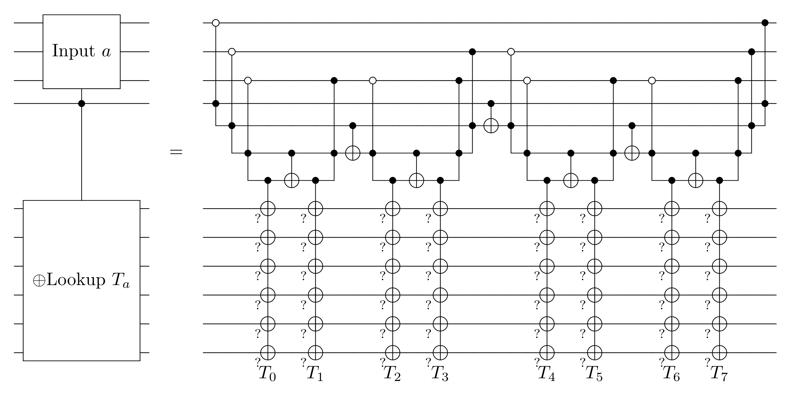
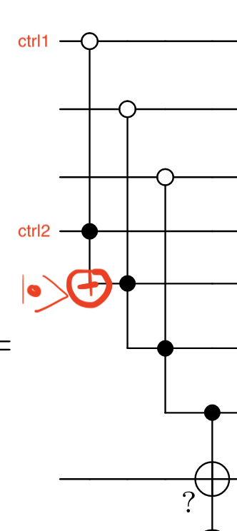
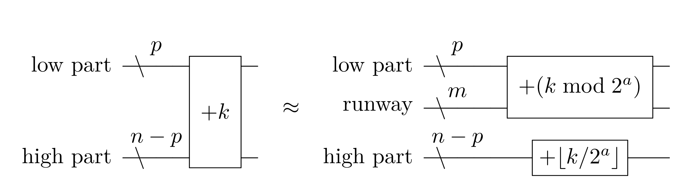
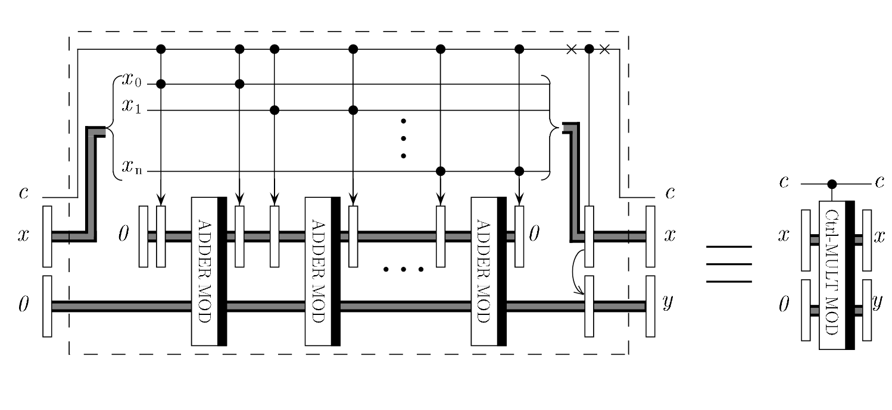

# Modular Exponentiation Implementation

In the paper Gidney et. al[^1] combined several previously proposed methods for
optimizing the modular exponentiation part of Shor's algorithm. His
implementation is focused on the superconducting qubit platfrom implementing
surface code with lattice surgery implementing some quantum gates. This document
aims to understand each optimization method mentioned in the paper.

## Integer Representation [^2]

We know that a controlled modular adder uses $10n$ Toffoli gates while the
controlled non-modular adder uses $4n$ Toffoli gates. Here $n$ is the number of
qubits used to represent a number. We may reduce the cost of addition if we
could use non-modular addition circuit to mimic the effect of modular adder.

!!! note "Rough Sektch of Modular Addition" 
    In the VBE[^3] paper, a modular addition was implemented. In order to
    compute $(a+b)%N$, you would first need to compte put in register $A$ $a+b$,
    then you compare is $a+b > N$ and put the result in a ctrl qubit. You would
    then use the control qubit to conditionally subtract $N$ from register $A$.
    Lastly, you will need to clear out the control bit with the comparison
    result of regiter $A$ with another register $B$ holding the result of $a+b$.
    

This is achieved by choosing to encode an integer $k$ (mod $N$) as quantum state
$\sqrt{2^{-c_{pad}}} \sum_{j=0}^{2^{c_{pad}} -1} \ket{jN+k}$ here $c_{pad}$ is
the number of qubits padded with the high-order qubits.

!!! warning "Order of Qubits"
    Please be aware of endianess of qubits. Craig seems to be using 
    large endianess where high order qubits are placed at the end
        
The number of padding needed scales logarithmically with how well the end result
approximates the modular result.

A naive understanding of the idea is perhaps demonstrated as the follows. Say we
want to compute $(k + y) % N$. Let's define $xN + k' \equiv k+y$ therefore
$(k+y)%N = k'$.

In the proposed encoding system, $k + y$ is encoded as $\ket{k+ y} + \ket{k+N +
y} + \ket{k+2N + y} + ...$ while $k'$ is encoded as $\ket{k'} + \ket{k' + N} +
\ket{k' + 2N} + ...$. Using the equation $k' = k + y - xN$ we could reexpress
$\ket{k'} = ... + \ket{k+y-N} + \ket{k+y} + \ket{k+y+N} + ...$ When the padding
is long enough, the two sums both become very long and they overlap more and
more.

More references including the circuit design for encoding $k$ into the coset
form could be found in section 4 in [^2]. More families of such approximate
encoding scheme can be found in section 3 of [^4].

## Windowed Arithmetic

A windowed arithmetic is algorithm that merges operations into lookup tables
that saves computation. 

### Lookup table

"A lookup table is an operation that retrieves classical data encoded in the
quantum register". To put it more concretely, given the fact that we would like
to accomplish the map of $\ket{j}\ket{0} \rightarrow \ket{j}\ket{T_j}$. We may
precompute the value $T_j$ corresponding to all values in the domain. Then
encode it into a quantum circuit. The quantum circuit will achieve the intended
mapping of $\sum_j \ket{j}\ket{0} \rightarrow \ket{j}\ket{T_j}$.

The unconventional control part of the circuit denotes the following.

A more systematic explaination of this notation is given in Figure 4 and 6 of [^7].

Take the first control gate for example, the hollow circle means anti-control,
the second solid circle means control and there is an implicit not gate acted
upon the third line. The qubit on the third line is initialized to be in
$\ket{0}$.

The question mark in the circuit denotes whether to appli the $X$ gate depending
on the value of $T_j$. 

It is motivated by the fact that classical computation is much less expensive
than quantum ones. Therefore, it makes sense to precompute things on the
classical machine and then query in with quantum circuit whenever needed.

!!! note "Lookup Table Uncomputation"
    I am not sure if measurement by uncomputation will be involved in the Shor's
    algorithm paper. The details of it remains unexplored.
    
### Windowed Arithmetic

The windowed arithmetic is a simple idea of breaking down arithmetic of the form
$x += k * y$ into multiple additions $x += 2^i * k * y_{i}$ for $i$ from 0 to
~len(y)~. A windowed version of it adds different. It does $x += 2^i *[y_i
y_{i+1} y_{i+2} ....y_{i+window}] * k$.

Note, this could be easily extended to doing multiplication.

!!! warning "Speed up Source" 
    I don't understand where is the logarithmic speed up coming from.

!!! note "Two's Complement"
    The integers will be represented in 2's complement format. The two's
    complement format consists of a signed bit and n bits. To encode a signed
    integer we first convert the absolute value of the integer $k$ into binary
    form. Then, we encode the bit value into the $n$ bits. Conditioned on the
    integer being negative, both the sign bit will be flipped and the $n$ bits
    number will be increased by 1 ignoring overflow.

## Oblivious Runway

The last algorithmic optimization is oblivious runway. Oblivious runway is an
algorithm that enables piece-wise addition breakdown of an addition circuit on
$n$ qubits.

The circuit that describes the runway is the following.

It works on the premise that it is very unlikley that a carry will be kept
carrying all the way to the last bit. Therefore, it may break down the addition
into pieces. The carry of each section is thrown away? (What about the decoherence created this way?)

# Performance

Regarding the performance, the most worrying parameter for an algorithm is the
number of Toffoli gates. The choice was made because for Gidney, Toffoli is more
costly than CNOT due to the cost of non-transversal T gate required. We
following this stream of thought but do note it might change based on the error
correction code you choose.

!!! warning "Slight Modification of Shor's Algorithm" 
    Gidney's paper uses an improved version of Shor's algorithm due to paper
    [^6]. It decrease the number of multiplication

## Reference

Gidney provided a reference implementation. 

1. The modified Shor's algorithm requires the usage of $n_e$ such controlled
   multiplication. where $n_e = 1.5 \cdot n + \mathcal{O}$ and $n = \lceil
   \log_{2} N \rceil$ and $N$ is the number being factored. It is expressed in
   the form of a series of multiplication that does the mapping $x \rightarrow x
   \cdot g^{2^j}$.
2. Each controlled multiplication is then decomposed to $2n$ controlled
   additions of the form $y += x \cdot k %N$ and $x += y\cdot (-k^{-1})$. The
   $2$ stands for each of the two additions. (We need $x$ along the way of
   multiplication, cannot do it inplace). The $n$ here stands for each $x \cdot
   k$ is done with $n$ addition of the form $y += x \cdot 2^{i} \cdot k_i$.
3. He considered using [^5] method of doing uncontrolled and non-modulo
   addition. This costs $\mathcal{O}(2n)$ Toffoli gates.
4. Using VBE's [^3] construction, we need $5$ such adder to perform a modulo
   addition. In Figure 5 of [^5], we were shown how to do controlled
   multiplication. The blank register denotes the place where you either copy
   $2^j \cdot x_j$ or leave it blank. This fascillates the controlled addition.

!!! note "Ancilla Used"
    Do note the $\mathcal{O}(1)$ amount of ancilla used during the computation.
    

In total, we need $n_e \cdot 2n \cdot 5 \cdot 2n = 20 n_e n^2$
Toffoli gates.

## Saving from Coset Representation

In the reference, the modular addition costs $5 \cdot 2n$ Toffoli gates. Using the coset representation, 

Firstly, we have to convert the number into coset representation 

$$\text{Prepare} \quad \frac{1}{\sqrt{x_{\max }}} \sum_{x=0}^{x_{\max
}-1}|x\rangle, \quad \text { then do } \quad|b\rangle|x\rangle \rightarrow
\quad|b+x N\rangle$$

This steps costs $2n^2$ Toffoli gates because we have to do controlled addition
of the form $2^j * x_{j} * N$ for $n$ times.

Secondly, there is an algorithm that does the non-modular addition with
$4n+\mathcal{O}(1)$ Toffoli gates [^5].

Overall, Gidney reports that the controlled modulo addition on computational
basis representation takes $\mathcal{O}(4n)$ Toffoli gates.

However, we note that this estimate did not take into the consideration of coset
representation encoding and extra qubits used in the representation and extra
cost of Toffoli they bought in.

## Saving from Windowed Arithmetic

We will investigate the cost saving of windowed arithmetic.

### Table Lookup
We first compare the cost saving of a table lookup. Let's assume that classical
computation of the table have negligible cost. In effect, computing the 

Naively, each table lookup has cost documented in section 2 of [^8]. If we would
like to store $L = 2^a$ entries of $g^1$ to $g^a$ on $W$ qubits, the number of
Toffoli gates are $L-1$ as indicated in the figure above. However, recomputation
requires measurement.

A less naive approach costs $\mathcal{O}(WL/k + k)$ Toffoli gates with
$\mathcal{O}(Wk)$ ancilleas. This optimization will not be taken because we
consider the case where $W$ is large and this optimization does not take effect
in that regime.

### Window Arithmetic

The window technique first reduces $n_e$ controlled multiplication to $n_e /
c_{exp}$ un-controlled multiplication. (Not sure why it is un-controlled$.

Each uncontrolled multiplication requires $2n$ controlled addition. And it is
achievable with $2n/c_{mul}$ number of addition. $c_{mul}$ means the number of
digits added at once.

### Combined 
In combination, we will need $\frac{2 n_e n}{c_{mul}c_{exp}} (2n + 2^{c_{mul} +
c_{exp}})$ Toffoli gates [^1]. And the ancilla qubits are ...

# Error Analysis

## Coset Representation
Comparing the representation of non-modular addition result in coset
representation and modular addition then converted to coset representation, we
see that they are just stagger superposition of computational basis and the
difference is at most $1$ basis state. Therefore, the infidelity scales as
$1/x_{max}$.

## Windowed Arithmetic

WHat is the probability that we will have logical error during the computation?

[^1]: [gidney2021factor](@cite)
[^2]: [zalka2006shor](@cite)
[^3]: [vedral1996quantum](@cite)
[^4]: [gidney2019approximate](@cite)
[^5]: [cuccaro2004new](@cite)
[^6]: [cryptoeprint:2016/1128](@cite)
[^7]: [Babbush2018Encoding](@cite)
[^8]: [gidney2019windowed](@cite)
